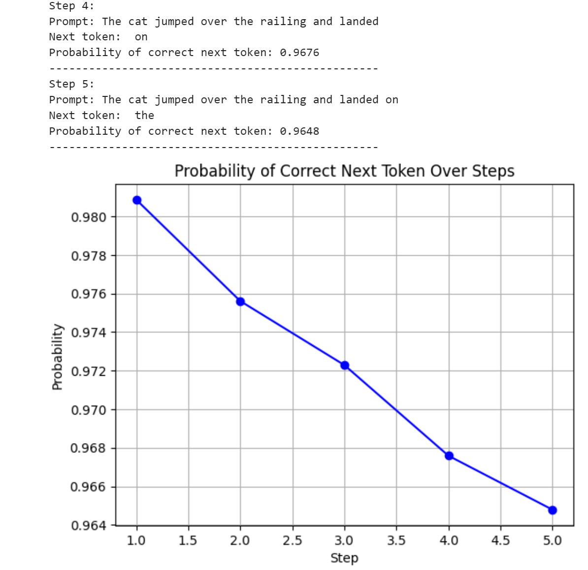

## Token Probability Analysis with Jupyter Notebook

This repository contains a Jupyter Notebook that calculates and visualizes how the probability of predicting the correct next token decreases as the context grows in length and complexity.

## How to Run the Notebook

**Clone the Repository**
   ```bash
   https://github.com/Great-Wave-AI/probabilitycalc.git
   cd your-repo-name
   ```
**Execute the Notebook**
Run the cells in the notebook step by step. When prompted:

Enter a Prompt: Provide a starting sentence or phrase. For example: "Why does it rain so much?"
Specify Alpha: Input a sensitivity factor (default is 0.01).

**Alpha and Its Effect**
Lower alpha values (e.g., 0.001) make the model seem more confident.
Higher alpha values reflect greater sensitivity to complexity.

## What the Notebook Does

### Calculates Token Probabilities

The notebook generates tokens step by step. For each step, it calculates the probability of correctly predicting the next token based on the length and complexity of the prompt.

### Visualizes the Probability Drop-Off

It plots a graph of token prediction probabilities over multiple steps.

### What the Graph Shows

-   **X-axis**: Step Number (sequence of token predictions).
-   **Y-axis**: Probability of Correct Prediction (calculated based on prompt length and complexity).

#### Insights:

-   The graph visualizes how the model’s confidence in predicting the next token decreases as the prompt grows in length and complexity.
-   The drop-off demonstrates how linguistic and contextual complexity impact token prediction accuracy.

## Example Usage

**Input**:


`Prompt: "Why does it rain so much?"
Alpha: 0.001` 

**Output**:


`Step 1: Prompt: "Why does it rain"
         Next token: "so"
         Probability: 0.9901
Step 2: Prompt: "Why does it rain so"
         Next token: "much"
         Probability: 0.9850
...` 

**Graph**: A plot showing the steady decline in probability with each step.


